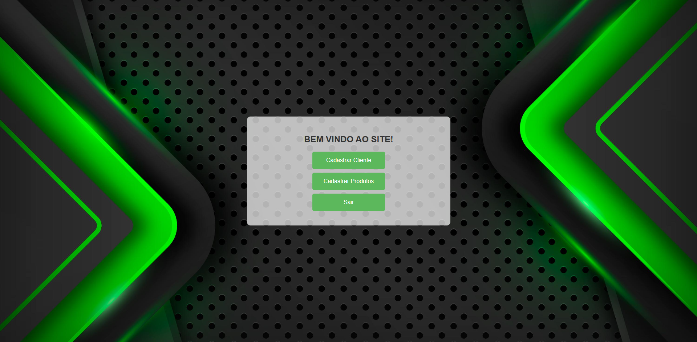

# Site HTML

Este é um projeto simples de cadastro de clientes e produtos utilizando HTML, CSS, JavaScript e Python. Ele contém quatro páginas principais:

- `home.html`: Página inicial com opções de navegação.
- `login.html`: Formulário para autenticação de usuários.
- `index.html`: Formulário para cadastro de clientes.
- `produto.html`: Formulário para cadastro de produtos.

## Estrutura do Projeto

```
/
├── home.html         # Página inicial
├── login.html        # Página de login
├── index.html        # Formulário de cadastro de clientes
├── produto.html      # Formulário de cadastro de produtos
├── css/
│   ├── styles.css    # Estilos para as páginas
│   ├── main.css      # Estilos adicionais
│   ├── imagens/      # Pasta contendo imagens utilizadas no projeto
├── js/
│   ├── main.js       # Script principal para interatividade
│   ├── login.js      # Script para gestão do login
|── test/
│   ├── teste_cadastro_cliente.py   # Teste automatizado para o formulario de clientes
│   ├── teste_cadastro_produto.py   # Teste automatizado para o formulario de produtos
    
```

## Funcionalidades

- `home.html`: Página de boas-vindas com botões de acesso aos cadastros e login.
- `login.html`: Permite que o usuário faça login para acessar as demais páginas.
- `index.html`: Permite cadastrar clientes com validação de CPF e telefone.
- `produto.html`: Permite cadastrar produtos com informações detalhadas, como código de barras, peso, dimensões e status.

## Como Usar

1. Abra ``home.html`` em um navegador.
2. Após isso ele ira direcionar para o `login.html` onde será realizado o login e a autenticação.
3. Após o login bem-sucedido, você poderá acessar as páginas de cadastro em `home.html`.
4. Clique em "Cadastrar Cliente" para acessar `index.html` e preencher o formulário.
5. Clique em "Cadastrar Produtos" para acessar `produto.html` e preencher os dados do produto.

## Tecnologias Utilizadas

- **HTML5** para estruturação do conteúdo.
- **CSS3** para estilização das páginas.
- **JavaScript** para interatividade e validação de formulários.
- **Python** para realizar testes automatizados

## Recursos Visuais

O projeto contém uma pasta `imagens/` dentro do diretório `css/`, onde estão armazenadas as imagens utilizadas na interface do sistema.

### Capturas de Tela

Abaixo estão algumas capturas de tela do projeto:


- 
- 
- 
- 
- 
- 

---

Projeto básico de cadastro de clientes e produtos com sistema de login. Qualquer contribuição é bem-vinda!

